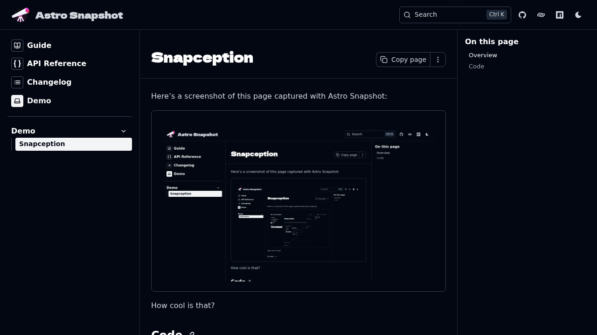

import { Card } from '@astrojs/starlight/components';
import { CodeFile } from 'starlight-theme-nova/components';

Here's a screenshot of this page captured with Astro Snapshot:

<Card>

</Card>

How cool is that?

## Code

Here's the config used to set this up:

<CodeFile path="astro.config.ts" />

For a complete example, check out the [source code](https://github.com/twocaretcat/astro-snapshot/tree/main/docs/site) for these docs.
